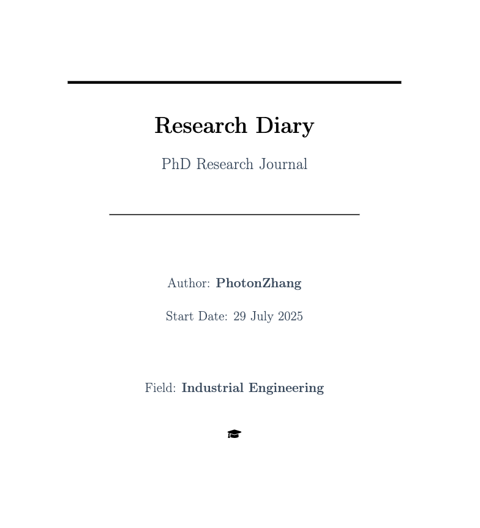
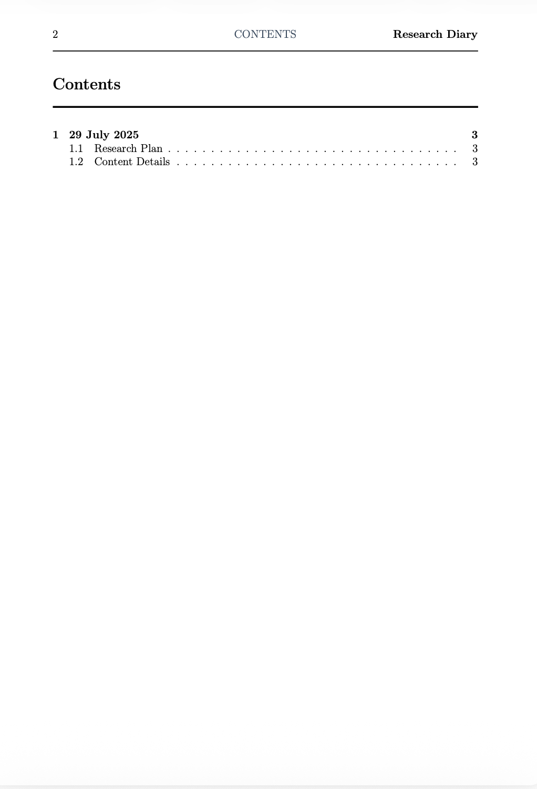
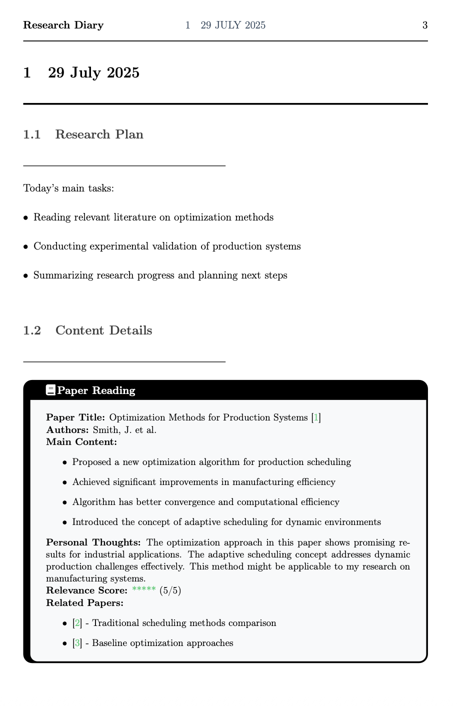
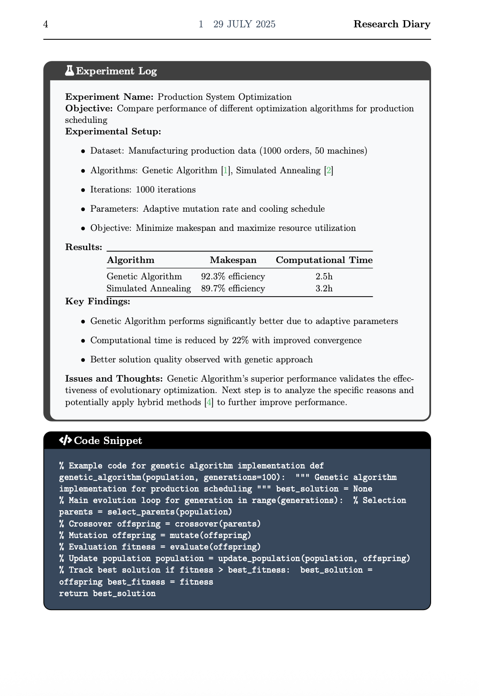
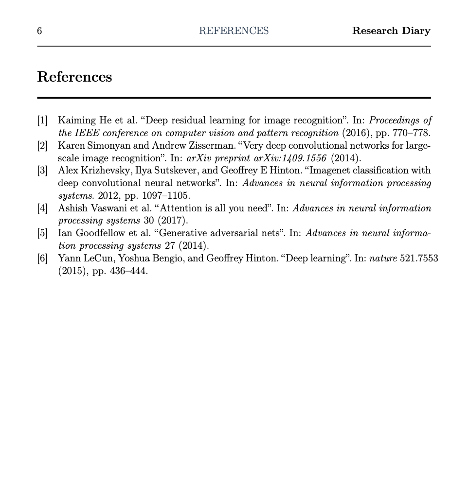

# Research Diary LaTeX Template

A professional LaTeX template for creating research diaries and journals, specifically designed for PhD students and researchers in Industrial Engineering.

[](https://github.com/PhotonZhang/research-diary-template)
[](LICENSE)
[](https://www.latex-project.org/)

> ⭐ **If this template helps you, please give it a star!** ⭐
> 
> Your support motivates us to keep improving and adding new features!

## 📸 Preview

### Title Page

*Professional title page with black-based design theme*

### Sample Diary Entry


*Example of a complete diary entry with all environments*

### Custom Environments




*Different content environments: Paper Reading, Experiment Log, Code Snippet, Important Note, and Daily Summary*

### Bibliography

*Automatically generated bibliography with proper formatting*

---

## 📋 Features

- **Modern Design**: Clean, professional black-based color scheme
- **Custom Environments**: Specialized boxes for different content types
- **Bibliography Support**: Full biblatex integration
- **FontAwesome Icons**: Visual enhancement with professional icons
- **Responsive Layout**: Optimized for both screen and print

## 📁 File Structure

```
ResearchDiary/
├── diary.tex              # Main diary template using the style package
├── researchdiary.sty      # Main style package
├── example_usage.tex      # Detailed usage examples
├── ref.bib                # Bibliography file
├── README.md              # This file
├── compile.sh             # Compilation script
├── clean.sh               # Cleanup script
└── diary.pdf              # Generated PDF output
```

## 🚀 Quick Start

### Option 1: Use the Style Package (Recommended)

1. **Create a new document**:
```latex
\documentclass[12pt,a4paper,twoside]{article}
\usepackage{researchdiary}
\addbibliographyfile{ref.bib}

\begin{document}
\maketitlepage{Your Name}
% Your content here
\end{document}
```

2. **Compile**:
```bash
pdflatex your_document.tex
biber your_document
pdflatex your_document.tex
```

### Option 2: Use the Example Template

Copy `diary.tex` and modify it according to your needs.

## 🎨 Available Environments

### Paper Reading Environment
```latex
\begin{paper}
\textbf{Paper Title:} Your Paper Title \cite{reference}
\textbf{Authors:} Author Names
\textbf{Main Content:}
\begin{itemize}
    \item Key point 1
    \item Key point 2
\end{itemize}
\textbf{Personal Thoughts:} Your thoughts here
\textbf{Relevance Score:} \textcolor{successgreen}{*****} (5/5)
\end{paper}
```

### Experiment Log Environment
```latex
\begin{experiment}
\textbf{Experiment Name:} Your Experiment
\textbf{Objective:} What you want to achieve
\textbf{Experimental Setup:}
\begin{itemize}
    \item Parameter 1
    \item Parameter 2
\end{itemize}
\textbf{Results:} Your results
\textbf{Key Findings:} Important discoveries
\end{experiment}
```

### Code Snippet Environment
```latex
\begin{codebox}
% Your code here
def your_function():
    return "Hello World"
\end{codebox}
```

### Important Note Environment
```latex
\begin{note}
\textbf{Important Discovery:} Your discovery
\begin{itemize}
    \item Point 1
    \item Point 2
\end{itemize}
\end{note}
```

### Daily Summary Environment
```latex
\begin{summary}
\textbf{Today's Achievements:}
\begin{itemize}
    \item Achievement 1
    \item Achievement 2
\end{itemize}
\textbf{Tomorrow's Plan:}
\begin{itemize}
    \item Plan 1
    \item Plan 2
\end{itemize}
\end{summary}
```

## 🎯 Customization

### Changing Colors

Edit the color definitions in `researchdiary.sty`:

```latex
\definecolor{primaryblack}{RGB}{0, 0, 0}           % Primary black
\definecolor{secondarygray}{RGB}{64, 64, 64}       % Secondary gray
\definecolor{accentdark}{RGB}{32, 32, 32}          % Accent dark
```

### Adding New Environments

Add new environments in `researchdiary.sty`:

```latex
\newtcolorbox{yourbox}[1][]{
    colback=lightgray,
    colframe=yourcolor,
    boxrule=2pt,
    leftrule=8pt,
    before skip=1em,
    after skip=1em,
    left=15pt,
    right=15pt,
    top=12pt,
    bottom=12pt,
    fontupper=\small,
    title={\faIcon\,\textbf{Your Title}},
    coltitle=white,
    colbacktitle=yourcolor,
    arc=8pt,
    #1
}
```

### Modifying Page Layout

Adjust page geometry in `researchdiary.sty`:

```latex
\geometry{
    left=2.5cm,
    right=2.5cm,
    top=3cm,
    bottom=3cm,
    headheight=25pt
}
```

## 📚 Bibliography Management

### Adding References

Add entries to `ref.bib`:

```bibtex
@article{key2024,
  title={Your Paper Title},
  author={Author, A. and Author, B.},
  journal={Journal Name},
  year={2024},
  volume={1},
  pages={1--10}
}
```

### Citing References

In your document:

```latex
This is a citation \cite{key2024}.
```

## 🔧 Compilation

### Required Software

- **LaTeX Distribution**: TeX Live or MiKTeX
- **Bibliography**: Biber (included with TeX Live)
- **Fonts**: FontAwesome 5 (included with tcolorbox)

### Compilation Commands

```bash
# First compilation
pdflatex your_document.tex

# Process bibliography
biber your_document

# Second compilation (for references)
pdflatex your_document.tex

# Third compilation (for table of contents)
pdflatex your_document.tex
```

### Troubleshooting

1. **Missing FontAwesome icons**: Install `fontawesome5` package
2. **Bibliography not showing**: Run `biber` after `pdflatex`
3. **Color issues**: Ensure `xcolor` package is loaded
4. **Box formatting**: Check `tcolorbox` package installation

## 📝 Usage Tips

### Daily Entry Structure

1. **Research Plan**: Outline today's objectives
2. **Paper Reading**: Document literature review
3. **Experiments**: Log experimental work
4. **Code**: Include relevant code snippets
5. **Notes**: Important discoveries and insights
6. **Summary**: Daily achievements and tomorrow's plan

### Best Practices

- **Consistent Formatting**: Use the same structure for each entry
- **Regular Updates**: Update your diary daily
- **Detailed Notes**: Include personal thoughts and insights
- **Cross-References**: Link related entries and papers
- **Code Documentation**: Include comments in code snippets

### Version Control

Consider using Git for version control:

```bash
git init
git add .
git commit -m "Initial research diary setup"
```

## 🎨 Design Philosophy

### Color Scheme

- **Primary Black**: Professional, authoritative
- **Secondary Gray**: Subtle, supporting
- **Success Green**: Positive outcomes
- **Warning Yellow**: Important notes
- **Light Gray**: Background, easy reading

### Typography

- **Clean Layout**: Generous whitespace
- **Hierarchical Structure**: Clear section organization
- **Professional Appearance**: Suitable for academic use
- **Print-Friendly**: Optimized for both screen and paper

## 📄 License

This project is licensed under the MIT License - see the [LICENSE](LICENSE) file for details.

The MIT License allows you to:
- Use the template for any purpose
- Modify and adapt the code
- Distribute copies
- Use commercially
- The only requirement is to include the original license and copyright notice

## 🤝 Contributing

To improve this template:

1. Fork the repository
2. Make your changes
3. Test with different content types
4. Submit a pull request

### Acknowledgments

This template was developed in collaboration with **Claude Sonnet 4 (AI Assistant)** from Anthropic, who provided significant contributions to:
- LaTeX package design and implementation
- Documentation and examples
- System architecture and modularization
- Professional styling and formatting

## 📞 Support

For issues or questions:

1. Check the troubleshooting section
2. Review the LaTeX compilation logs
3. Ensure all required packages are installed
4. Test with the provided example files
5. Open an issue on GitHub for bugs or feature requests
6. Contact: zyw23@mails.tsinghua.edu

## 📋 Version History

### Version 1.0 (July 29, 2025)
- **Initial Release**: Complete research diary template system
- **Features**:
  - Professional black-based design theme
  - Custom environments for different content types
  - Bibliography support with biblatex
  - FontAwesome icons integration
  - Modular LaTeX package design
  - Industrial Engineering focus
  - Complete documentation and examples
  - GitHub-ready with MIT license
- **Collaboration**: Developed with Claude Sonnet 4 (AI Assistant)
- **Documentation**: Comprehensive README and usage examples

---

**Author**: PhotonZhang  
**Email**: zyw23@mails.tsinghua.edu  
**Field**: Industrial Engineering  
**Collaborator**: Claude Sonnet 4 (AI Assistant)  
**Version**: 1.0  
**Release Date**: July 29, 2025 (Beijing Time)

## 🌟 Support This Project

If this template helps you in your research journey, please consider:

- ⭐ **Star this repository** - It helps others discover this template
- 🔄 **Share with colleagues** - Spread the word in your research community
- 💬 **Report issues** - Help improve the template
- 🚀 **Contribute** - Submit pull requests for new features
- 📧 **Contact** - Reach out with suggestions or feedback

### Citation

If you use this template in your research or publications, please cite:

```bibtex
@software{photonzhang_research_diary_2025,
  title={Research Diary LaTeX Template},
  author={PhotonZhang},
  year={2025},
  url={https://github.com/PhotonZhang/research-diary-template},
  note={A professional LaTeX template for research diaries and journals}
}
```

### Share Your Work

We'd love to see how you use this template! Share your research diary examples by:

1. Creating an issue with screenshots
2. Mentioning us on social media with #ResearchDiaryTemplate
3. Adding your work to the examples section

---

**Thank you for using Research Diary Template!** 🎓  